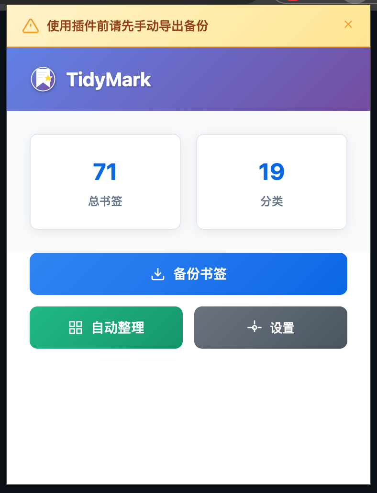
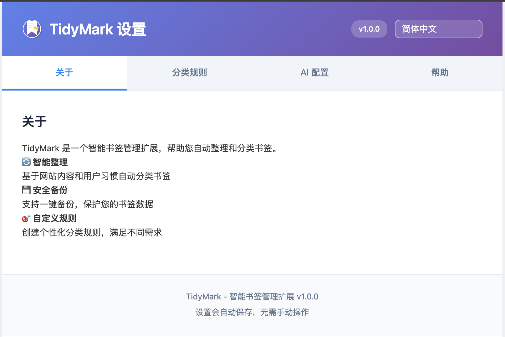

# TidyMark — Smart Bookmark Organizer (Chrome/Edge Extension)

English | [中文说明](#tidymark--智能书签整理扩展)

TidyMark is a lightweight browser extension that helps you back up, organize, and manage bookmarks intelligently. It supports OpenAI- and DeepSeek-compatible AI assistance and works out of the box with Manifest V3.

## Features

- Backup: automatically exports bookmarks to a JSON file; one-click restore
- Auto categorize: keyword-based intelligent categorization
- “Other” folder management: batch move and organize uncategorized items
- Category management UI: straightforward add, delete, and edit
- Post-organize cleanup: optionally removes now-empty source folders

## Roadmap

- AI assistant for classification (OpenAI & DeepSeek)
- Quick search and rule customization
- Future: tagging, stats dashboard, undo, cloud sync

## Installation

- Clone or download this repository
- Open `chrome://extensions/` (or `edge://extensions/`)
- Enable “Developer mode”
- Click “Load unpacked” and select the project folder

## Usage

- First run: click the extension icon; an automatic backup is created
- Auto organize: click “Auto Organize” to categorize bookmarks
- Manual manage: review and adjust categories in the popup UI
- Settings: right-click the icon → “Options” to configure AI provider/model and limits
- Backup/restore: export/import JSON backups from the Options page

## Screenshots

<a href="./home.png"></a>
<a href="./setting.png"></a>

## Configuration

- AI provider: `OpenAI` and `DeepSeek` (OpenAI-compatible endpoints supported)
- Model selection: DeepSeek exposes `deepseek-chat`; “reasoner” models are blocked
- Max tokens: default `10000`; configurable in Options (stored per user)

### Default Categories (excerpt)

```json
[
  { "category": "Dev Tools", "keywords": ["github", "gitlab", "api", "docs"] },
  { "category": "News", "keywords": ["news", "blog", "medium", "zhihu"] },
  { "category": "Education", "keywords": ["course", "tutorial", "learn", "university"] },
  { "category": "Tools", "keywords": ["tool", "software", "app", "utility"] },
  { "category": "Entertainment", "keywords": ["video", "music", "game", "movie"] },
  { "category": "Shopping", "keywords": ["shop", "store", "amazon", "taobao"] },
  { "category": "Social Media", "keywords": ["twitter", "facebook", "instagram", "linkedin"] },
  { "category": "Finance", "keywords": ["bank", "finance", "investment", "crypto"] },
  { "category": "AI & ML", "keywords": ["ai", "ml", "huggingface", "openai"] },
  { "category": "Cloud & DevOps", "keywords": ["docker", "k8s", "cloudflare", "vercel"] },
  { "category": "Notes & Knowledge", "keywords": ["obsidian", "evernote", "wiki", "notion"] },
  { "category": "Project & Tasks", "keywords": ["asana", "trello", "todoist", "clickup"] },
  { "category": "Maps & Navigation", "keywords": ["google maps", "osm", "gaode", "baidu map"] },
  { "category": "Blogging & CMS", "keywords": ["wordpress", "ghost", "blogger", "cms"] }
]
```

Full rule set lives in `services/classificationService.js` and `services/defaultRules.js`.

## Tech Stack

- Manifest V3, native HTML/CSS/JavaScript
- Chrome Extensions API for bookmarks, storage, downloads

## Project Structure

```
TidyMark/
├── manifest.json
├── popup.html / popup.css / popup.js
├── options.html / options.css / options.js
├── background.js
├── icons/
└── services/
    ├── bookmarkService.js
    ├── storageService.js
    ├── classificationService.js
    └── i18n.js
```

## Permissions

- `bookmarks`, `storage`, `downloads`, `activeTab`

## Contributing

- Issues and PRs are welcome! Please keep changes minimal, focused, and consistent with the existing style.
- Internationalization: English and Simplified Chinese are supported. Contributions to more locales are appreciated.
- For AI features, prefer OpenAI-compatible HTTP APIs. “Reasoner” models with non-standard outputs are intentionally disabled.

## License

MIT License — see `LICENSE`.

---

# TidyMark — 智能书签整理扩展

英文说明 | [中文说明](#tidymark--智能书签整理扩展)

TidyMark 是一个轻量的 Chrome/Edge 浏览器扩展，帮助你备份、自动整理和高效管理书签。支持 OpenAI/DeepSeek 兼容的 AI 能力，并基于 Manifest V3 原生实现。

## 功能特性

- 书签备份：自动导出 JSON，支持一键恢复
- 自动分类：基于关键词的智能分类
- 其他目录管理：管理未分类书签，支持批量移动
- 分类管理界面：直观增删改
- 整理后清理：可自动删除已变为空的源目录

## 路线图

- AI 分类辅助（支持 OpenAI/DeepSeek）
- 快速搜索与自定义规则
- 未来：标签、统计面板、撤销、云同步

## 安装方法

- 下载或克隆本仓库
- 打开 `chrome://extensions/` 或 `edge://extensions/`
- 开启“开发者模式”
- 点击“加载已解压的扩展程序”，选择项目文件夹

## 使用方法

- 首次使用：点击扩展图标，系统会自动创建备份
- 自动整理：点击“自动整理”根据规则分类书签
- 手动管理：在弹出窗口中查看和调整分类
- 设置配置：在“选项”页面配置 AI 服务商/模型和最大 Token
- 备份恢复：在“选项”页面导出/导入 JSON 备份

## 界面截图

<a href="./home.png"></a>
<a href="./setting.png"></a>

## 配置说明

- AI 服务商：支持 `OpenAI` 与 `DeepSeek`（兼容 OpenAI HTTP 接口）
- 模型选择：DeepSeek 当前提供 `deepseek-chat`；“reasoner/思考型”模型被屏蔽
- 最大 Token：默认 `8192`，可在选项页自定义（按用户存储）

### 默认分类（片段）

```json
[
  { "category": "开源与代码托管", "keywords": ["github", "gitlab", "gitee", "bitbucket", "source code", "repository", "repo"] },
  { "category": "开发文档与API", "keywords": ["docs", "documentation", "api", "sdk", "developer", "reference", "文档", "接口"] },
  { "category": "前端框架", "keywords": ["react", "vue", "angular", "svelte", "nextjs", "nuxt", "vite", "webpack", "babel"] },
  { "category": "后端框架", "keywords": ["spring", "django", "flask", "fastapi", "express", "koa", "rails", "laravel", "nestjs"] },
  { "category": "云服务与DevOps", "keywords": ["aws", "azure", "gcp", "cloud", "kubernetes", "k8s", "docker", "ci", "cd", "devops", "cloudflare", "vercel", "netlify"] },
  { "category": "数据库与数据", "keywords": ["mysql", "postgres", "mongodb", "redis", "sqlite", "elasticsearch", "clickhouse", "data", "数据库"] },
  { "category": "AI与机器学习", "keywords": ["ai", "ml", "deep learning", "transformer", "openai", "huggingface", "stable diffusion", "llm", "midjourney", "dalle"] },
  { "category": "技术博客与社区", "keywords": ["blog", "博客", "medium", "dev.to", "reddit", "社区", "论坛"] },
  { "category": "新闻资讯与媒体", "keywords": ["news", "资讯", "newsletter", "techcrunch", "hacker news"] },
  { "category": "在线工具与服务", "keywords": ["tool", "工具", "software", "app", "utility", "online", "smallpdf", "tinypng"] },
  { "category": "视频与音乐", "keywords": ["youtube", "bilibili", "netflix", "spotify", "视频", "音乐"] },
  { "category": "购物电商", "keywords": ["shop", "购物", "store", "taobao", "jd", "amazon", "aliexpress"] },
  { "category": "社交媒体", "keywords": ["twitter", "x.com", "facebook", "instagram", "tiktok", "linkedin", "wechat", "weibo", "discord", "telegram"] }
]
```

完整规则见 `services/classificationService.js` 与 `services/defaultRules.js`。

## 技术栈

- Manifest V3 + 原生 HTML/CSS/JavaScript
- Chrome 扩展 API：书签、存储、下载

## 项目结构

```
TidyMark/
├── manifest.json
├── popup.html / popup.css / popup.js
├── options.html / options.css / options.js
├── background.js
├── icons/
└── services/
    ├── bookmarkService.js
    ├── storageService.js
    ├── classificationService.js
    └── i18n.js
```

## 权限说明

- `bookmarks`、`storage`、`downloads`、`activeTab`

## 贡献

- 欢迎提交 Issue 与 Pull Request！建议将改动保持简洁、聚焦，并与现有代码风格一致。
- 国际化：当前支持英文与简体中文，欢迎补充更多语言。
- AI 功能：优先使用 OpenAI 兼容 HTTP 接口；“reasoner/思考型”模型因返回格式不兼容而禁用。

## 许可证

MIT License — 详见 `LICENSE` 文件。