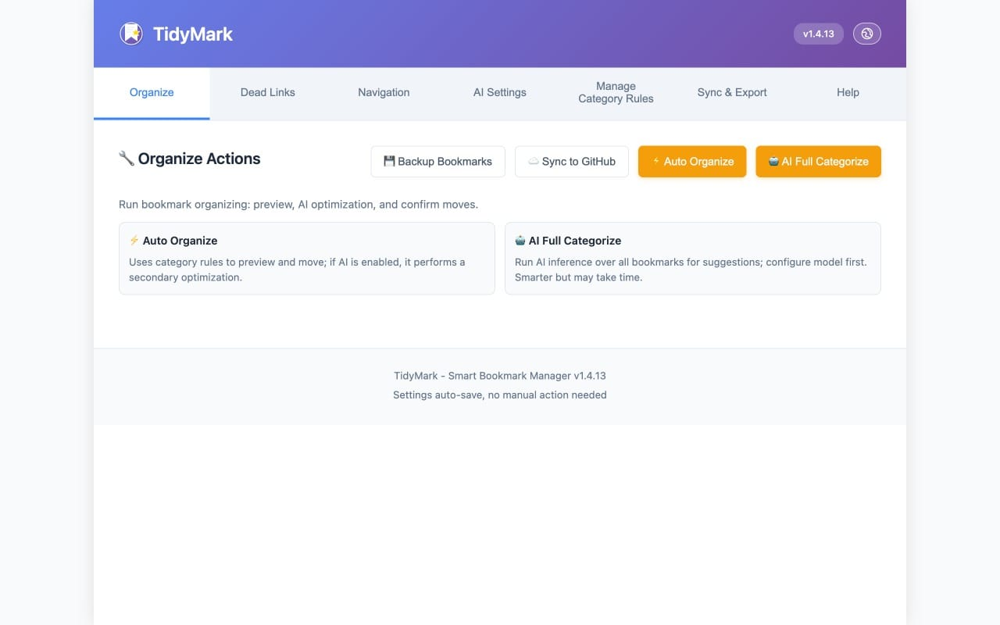
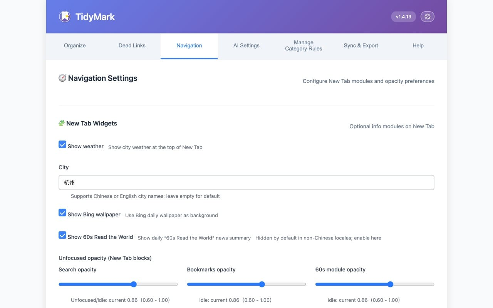
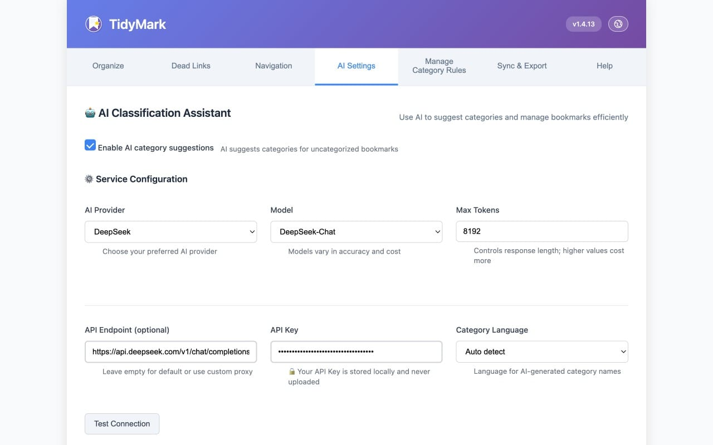
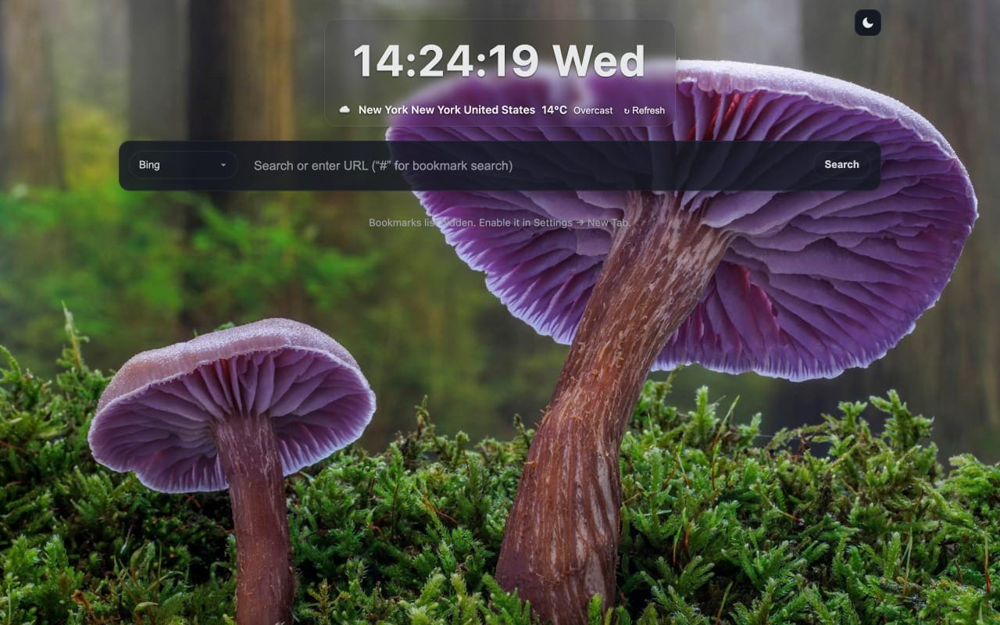

<!-- Language: switch between English and Chinese -->
[English] | [中文](./README.zh-CN.md)

# TidyMark — Smart Bookmark Organizer Extension

A lightweight Chrome/Edge extension that supports automatic categorization, AI-assisted organizing, dead bookmark detection, and New Tab navigation. Built natively with Manifest V3.

## Features

- Auto categorization: organize bookmarks into categories by rules with one click.
- AI assistance: supports OpenAI/DeepSeek (compatible endpoints) to improve classification.
- Dead bookmarks: scan unreachable links; bulk delete or move; optionally limit scanning to a specific folder; ignore internal/local addresses (127.0.0.1, localhost, 10.x, 192.168.x, 172.16–31.x).
- New Tab navigation: show categorized navigation and common information on the New Tab page.
- Bookmark cloud backup / export: daily GitHub backup (configurable in Options), plus manual local backup export.
- Auto-archive old bookmarks: based on “last visited time”, move less-used bookmarks to the “Archive” folder (threshold configurable, default 180 days; fallback to added time when no visit record).
- Visit frequency stats / usage heat analysis: record bookmark visits and recent activity on the New Tab; supports a “Top” section and basic usage insights.
- Context menu integration: right-click “Add to TidyMark and categorize”; automatically create and move to the matched category folder.

## Installation

- Download the ZIP from GitHub Releases.
- Open `chrome://extensions/` or `edge://extensions/`.
- Enable “Developer mode”, click “Load unpacked”, and select the unzipped folder.

## Screenshots

— Core info only. For more details, please refer to the source code and comments.

## License

MIT License — see `LICENSE`.