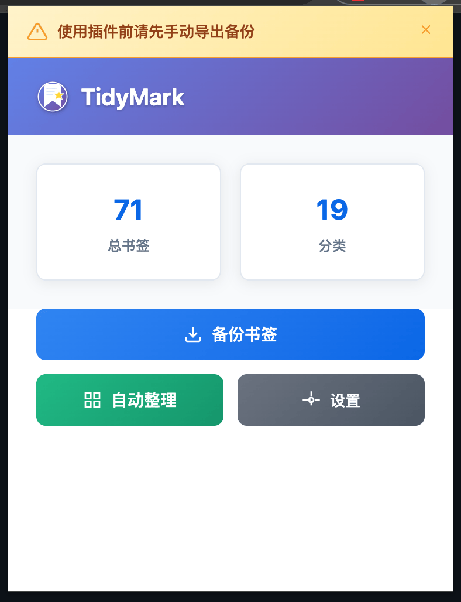
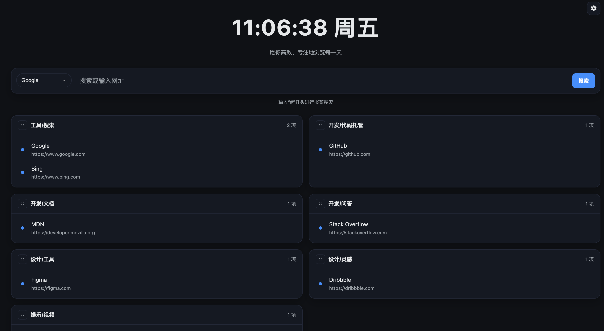

# TidyMark — 智能书签整理扩展

中文说明 | [English](#tidymark--smart-bookmark-organizer-chromeedge-extension)

TidyMark 是一个轻量的 Chrome/Edge 浏览器扩展，帮助你备份、自动整理和高效管理书签。支持 OpenAI/DeepSeek 兼容的 AI 能力，并基于 Manifest V3 原生实现。

## 功能特性

- 书签备份：在选项页手动导出/导入 JSON 备份。
- 自动分类：基于关键词规则，一键整理书签到对应类别。
- AI 辅助整理：支持 OpenAI/DeepSeek，提升分类准确度与覆盖面。
- 导航功能：覆盖新标签页，数据来自浏览器书签；需关闭时删除 `manifest.json` 中 `chrome_url_overrides.newtab` 配置。


## 安装方法

- 前往 GitHub Releases 页面，下载发行版压缩包（ZIP）
- 解压后打开 `chrome://extensions/` 或 `edge://extensions/`
- 开启“开发者模式”，点击“加载已解压的扩展程序”，选择解压后的文件夹

## 使用方法

- 自动整理：点击“自动整理”根据规则分类书签
- 手动管理：在弹出窗口中查看和调整分类
- 设置配置：在“选项”页面配置 AI 服务商/模型

- 预览调整：在“整理预览”弹窗中，点击书签即可切换分类；可在选择框中选择已有分类或新增分类。

### 注意事项（AI 优化）

- 使用 AI 优化分类时，响应可能需要 2–3 分钟，请耐心等待。
- 在响应完成前，请保持插件界面处于打开状态；若提前关闭界面，请求会中断，导致优化失效。

## 界面截图

<a href="./assets/screenshots/home.png"></a>
<a href="./assets/screenshots/setting.png"></a>
<a href="./assets/screenshots/nav.png"></a>

导航页：基于浏览器书签的分类导航，支持搜索引擎/主题切换；搜索结果在新标签页打开。

## 新标签页导航

- 扩展通过 `manifest.json` 的 `chrome_url_overrides.newtab` 指向 `src/pages/newtab/index.html` 覆盖浏览器“新标签页”。
- 关闭覆盖：请在 `manifest.json` 中删除以下配置并重新加载扩展：

```json
{ "chrome_url_overrides": { "newtab": "src/pages/newtab/index.html" } }
```

## 配置说明

- AI 服务商：支持 `OpenAI` 与 `DeepSeek`（兼容 OpenAI HTTP 接口）
- 支持模型：`OpenAI` 系列与 `DeepSeek` 的 `deepseek-chat`

### 默认分类（片段）

```json
[
  { "category": "开源与代码托管", "keywords": ["github", "gitlab", "gitee", "bitbucket", "source code", "repository", "repo"] },
  { "category": "开发文档与API", "keywords": ["docs", "documentation", "api", "sdk", "developer", "reference", "文档", "接口"] },
  { "category": "前端框架", "keywords": ["react", "vue", "angular", "svelte", "nextjs", "nuxt", "vite", "webpack", "babel"] },
  { "category": "后端框架", "keywords": ["spring", "django", "flask", "fastapi", "express", "koa", "rails", "laravel", "nestjs"] },
  { "category": "云服务与DevOps", "keywords": ["aws", "azure", "gcp", "cloud", "kubernetes", "k8s", "docker", "ci", "cd", "devops", "cloudflare", "vercel", "netlify"] },
  { "category": "数据库与数据", "keywords": ["mysql", "postgres", "mongodb", "redis", "sqlite", "elasticsearch", "clickhouse", "data", "数据库"] },
  { "category": "AI与机器学习", "keywords": ["ai", "ml", "deep learning", "transformer", "openai", "huggingface", "stable diffusion", "llm", "midjourney", "dalle"] },
  { "category": "技术博客与社区", "keywords": ["blog", "博客", "medium", "dev.to", "reddit", "社区", "论坛"] },
  { "category": "新闻资讯与媒体", "keywords": ["news", "资讯", "newsletter", "techcrunch", "hacker news"] },
  { "category": "在线工具与服务", "keywords": ["tool", "工具", "software", "app", "utility", "online", "smallpdf", "tinypng"] },
  { "category": "视频与音乐", "keywords": ["youtube", "bilibili", "netflix", "spotify", "视频", "音乐"] },
  { "category": "购物电商", "keywords": ["shop", "购物", "store", "taobao", "jd", "amazon", "aliexpress"] },
  { "category": "社交媒体", "keywords": ["twitter", "x.com", "facebook", "instagram", "tiktok", "linkedin", "wechat", "weibo", "discord", "telegram"] }
]
```

完整规则见 `services/classificationService.js` 与 `services/defaultRules.js`。

## 技术栈

- Manifest V3 + 原生 HTML/CSS/JavaScript
- Chrome 扩展 API：书签、存储、下载

## 项目结构

```
TidyMark/
├── manifest.json
├── src/
│   ├── background/
│   │   └── index.js
│   └── pages/
│       ├── popup/
│       │   ├── index.html
│       │   ├── index.css
│       │   └── index.js
│       ├── options/
│       │   ├── index.html
│       │   ├── index.css
│       │   └── index.js
│       └── newtab/
│           ├── index.html
│           ├── index.css
│           └── index.js
│       └── reset/
│           └── index.html
├── services/
│   ├── bookmarkService.js
│   ├── storageService.js
│   ├── classificationService.js
│   └── i18n.js
├── icons/
└── assets/
    └── screenshots/
        ├── home.png
        ├── setting.png
        └── nav.png
```

## 权限说明

- `bookmarks`、`storage`、`downloads`、`activeTab`

## 贡献

- 欢迎提交 Issue 与 Pull Request！建议将改动保持简洁、聚焦，并与现有代码风格一致。
- 国际化：当前支持英文与简体中文，欢迎补充更多语言。

---

# TidyMark — Smart Bookmark Organizer (Chrome/Edge Extension)

English | [中文说明](#tidymark--智能书签整理扩展)

TidyMark is a lightweight browser extension that helps you back up, organize, and manage bookmarks intelligently. It supports OpenAI- and DeepSeek-compatible AI assistance and works out of the box with Manifest V3.

## Features

- Bookmark backup: manually export/import JSON backups from Options.
- Auto categorize: keyword rules to organize bookmarks with one click.
- AI-assisted organizing: supports OpenAI/DeepSeek to improve accuracy and coverage.
- Navigation: overrides New Tab, data from browser bookmarks; to disable remove `chrome_url_overrides.newtab` in `manifest.json`.

## Installation

- Download the release ZIP from GitHub Releases
- Unzip and open `chrome://extensions/` (or `edge://extensions/`)
- Enable “Developer mode” and click “Load unpacked”, select the unzipped folder

## Usage

- Auto organize: click “Auto Organize” to categorize bookmarks
- Manual manage: review and adjust categories in the popup UI
- Settings: right-click the icon → “Options” to configure AI provider/model

- Preview adjust: in the organize preview dialog, click a bookmark to change its category; choose an existing category or add a new one in the picker.

### Notes (AI Optimization)

- AI optimization can take 2–3 minutes. Please wait for the response to finish.
- Keep the extension UI open until completion; closing it early interrupts the request and the optimization will not take effect.

## Screenshots

<a href="./assets/screenshots/home.png"></a>
<a href="./assets/screenshots/setting.png"></a>
<a href="./assets/screenshots/nav.png"></a>

Navigation: bookmark-based categorized navigation with search engine/theme switch; searches open in a new tab.

## New Tab Navigation

- The extension overrides the browser New Tab via `manifest.json` → `chrome_url_overrides.newtab` pointing to `src/pages/newtab/index.html`.
- To disable overriding, remove the following from `manifest.json` and reload the extension:

```json
{ "chrome_url_overrides": { "newtab": "src/pages/newtab/index.html" } }
```

## Configuration

- AI provider: `OpenAI` and `DeepSeek` (OpenAI-compatible endpoints supported)
- Supported models: OpenAI family and DeepSeek `deepseek-chat`

### Default Categories (excerpt)

```json
[
  { "category": "Dev Tools", "keywords": ["github", "gitlab", "api", "docs"] },
  { "category": "News", "keywords": ["news", "blog", "medium", "zhihu"] },
  { "category": "Education", "keywords": ["course", "tutorial", "learn", "university"] },
  { "category": "Tools", "keywords": ["tool", "software", "app", "utility"] },
  { "category": "Entertainment", "keywords": ["video", "music", "game", "movie"] },
  { "category": "Shopping", "keywords": ["shop", "store", "amazon", "taobao"] },
  { "category": "Social Media", "keywords": ["twitter", "facebook", "instagram", "linkedin"] },
  { "category": "Finance", "keywords": ["bank", "finance", "investment", "crypto"] },
  { "category": "AI & ML", "keywords": ["ai", "ml", "huggingface", "openai"] },
  { "category": "Cloud & DevOps", "keywords": ["docker", "k8s", "cloudflare", "vercel"] },
  { "category": "Notes & Knowledge", "keywords": ["obsidian", "evernote", "wiki", "notion"] },
  { "category": "Project & Tasks", "keywords": ["asana", "trello", "todoist", "clickup"] },
  { "category": "Maps & Navigation", "keywords": ["google maps", "osm", "gaode", "baidu map"] },
  { "category": "Blogging & CMS", "keywords": ["wordpress", "ghost", "blogger", "cms"] }
]
```

Full rule set lives in `services/classificationService.js` and `services/defaultRules.js`.

## Tech Stack

- Manifest V3, native HTML/CSS/JavaScript
- Chrome Extensions API for bookmarks, storage, downloads

## Project Structure

```
TidyMark/
├── manifest.json
├── src/
│   ├── background/
│   │   └── index.js
│   └── pages/
│       ├── popup/
│       │   ├── index.html
│       │   ├── index.css
│       │   └── index.js
│       ├── options/
│       │   ├── index.html
│       │   ├── index.css
│       │   └── index.js
│       ├── newtab/
│       │   ├── index.html
│       │   ├── index.css
│       │   └── index.js
│       └── reset/
│           └── index.html
├── services/
│   ├── bookmarkService.js
│   ├── storageService.js
│   ├── classificationService.js
│   └── i18n.js
├── icons/
└── assets/
    └── screenshots/
        ├── home.png
        ├── setting.png
        └── nav.png
```

## Permissions

- `bookmarks`, `storage`, `downloads`, `activeTab`

## Contributing

- Issues and PRs are welcome! Please keep changes minimal, focused, and consistent with the existing style.
- Internationalization: English and Simplified Chinese are supported. Contributions to more locales are appreciated.

## 许可证 / License

MIT License — 详见/see `LICENSE`。