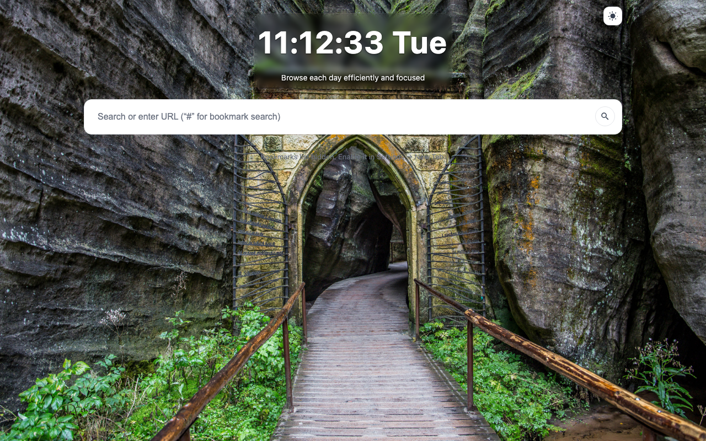
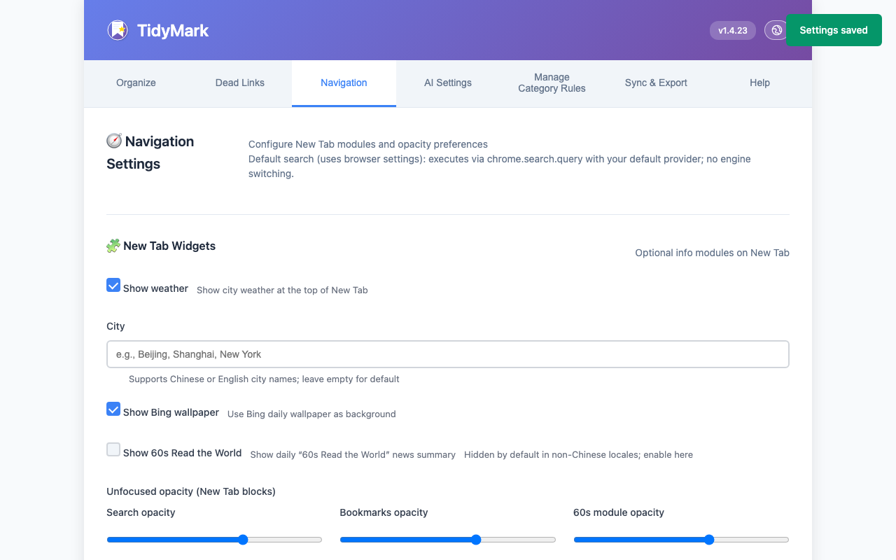
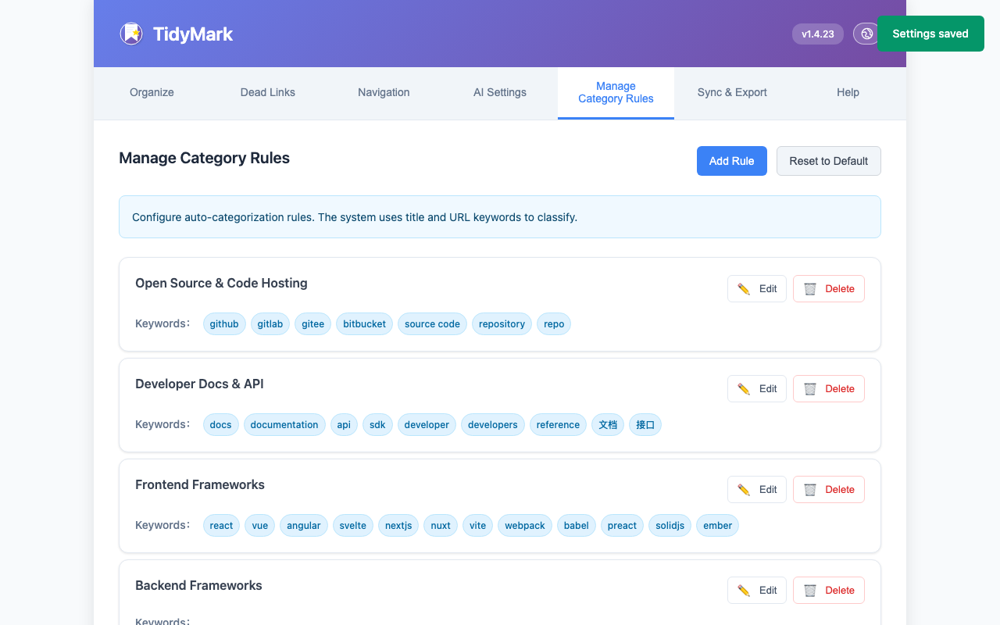
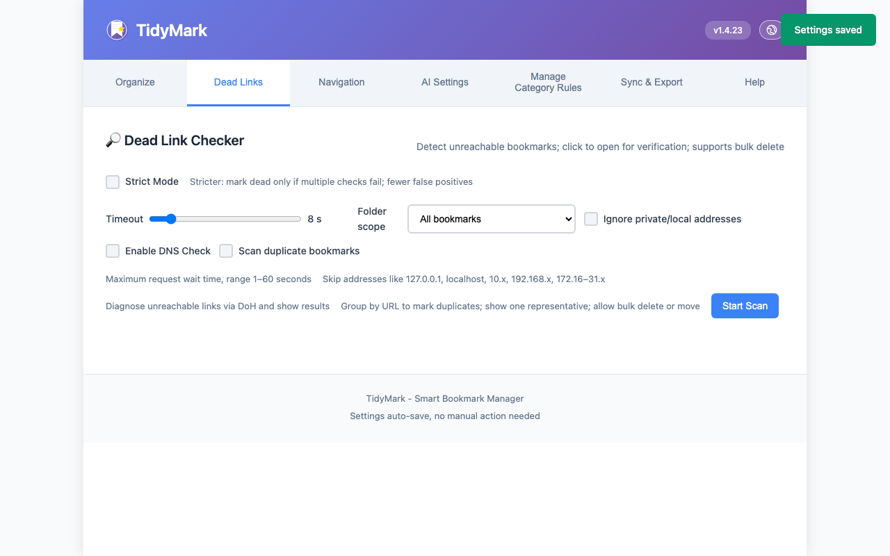
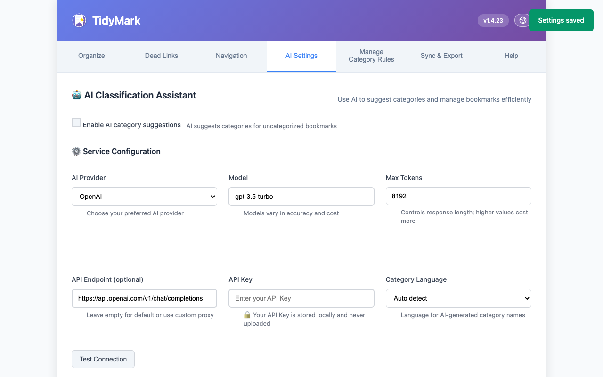

<!-- Language: switch between English and Chinese -->
[English] | [中文](./README.zh-CN.md)

# TidyMark — Smart Bookmark Organizer Extension

A lightweight Chrome/Edge extension that supports automatic categorization, AI-assisted organizing, dead bookmark detection, and New Tab navigation. Built natively with Manifest V3.

## Features

- Auto categorization: organize bookmarks into categories by rules with one click.
- AI assistance: supports OpenAI/DeepSeek (compatible endpoints) to improve classification.
- Dead bookmarks: scan unreachable links; bulk delete or move; optionally limit scanning to a specific folder; ignore internal/local addresses (127.0.0.1, localhost, 10.x, 192.168.x, 172.16–31.x).
- New Tab navigation: show categorized navigation and common information on the New Tab page.
- Bookmark cloud backup / export: daily GitHub backup (configurable in Options), plus manual local backup export.
- Auto-archive old bookmarks: based on “last visited time”, move less-used bookmarks to the “Archive” folder (threshold configurable, default 180 days; fallback to added time when no visit record).
- Visit frequency stats / usage heat analysis: record bookmark visits and recent activity on the New Tab; supports a “Top” section and basic usage insights.
- Context menu integration: right-click “Add to TidyMark and categorize”; automatically create and move to the matched category folder.

## Installation & Variants

> Note: After installation, when you first open a New Tab, the browser may prompt to keep the extension’s New Tab override (Chrome/Edge). If you don’t need the New Tab page, choose “Decline / Restore default”. This does not affect core features like bookmark organizing, classification, and backup; your browser’s default New Tab remains.

### Variants

- Organize-only (default recommendation): does not override New Tab; no navigation UI; retains bookmark organizing, classification, dead-links, backup, and GitHub sync. Download: `tidymark-organize-<version>.zip` from GitHub Releases, or load `extensions/organize/` in Developer Mode.
- Full (with navigation): includes a New Tab navigation and settings; other features are the same. Available via stores or GitHub Releases.
  - Stores (Full):  
    - Chrome Web Store: https://chromewebstore.google.com/detail/tidymark/kfjmkmodmoabhcmgeojbnjbipgiknfkb?utm_source=item-share-cb  
    - Microsoft Edge Add-ons: https://microsoftedge.microsoft.com/addons/detail/tidymark/ndfhjpodnchjkgpheaompahphpknmpjp
  - Stores (Organize-only):  
    - Chrome Web Store: https://chromewebstore.google.com/detail/pbpfkmnamjpcomlcbdjhbgcpijfafiai?utm_source=item-share-cb
  - GitHub Releases (both variants): https://github.com/PanHywel/TidyMark/releases

### Developer Mode

- Download and unzip the package from GitHub Releases.
- Open `chrome://extensions/` or `edge://extensions/`.
- Enable “Developer mode”, click “Load unpacked”, and select the unzipped `tidymark-organize-...` (organize-only) or `tidymark-full-...` (full) folder.

## Screenshots

— Core info only. For more details, please refer to the source code and comments.

## License

MIT License — see `LICENSE`.