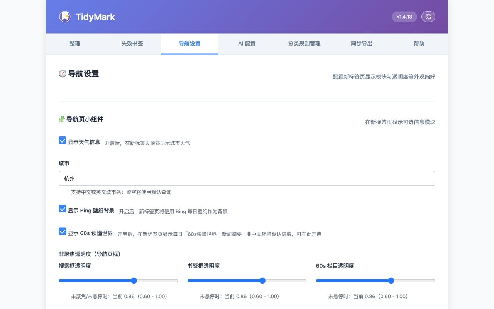
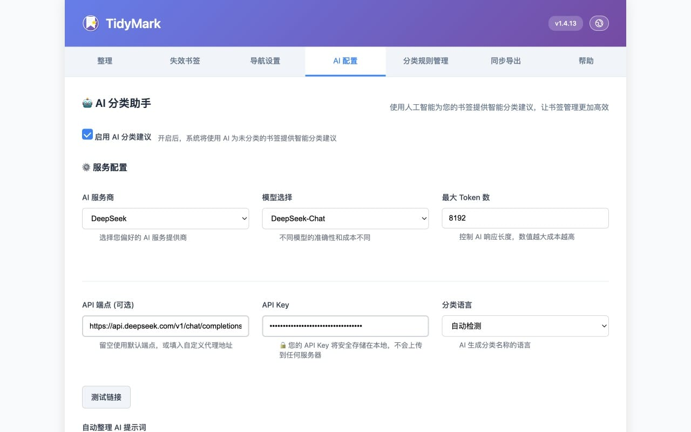
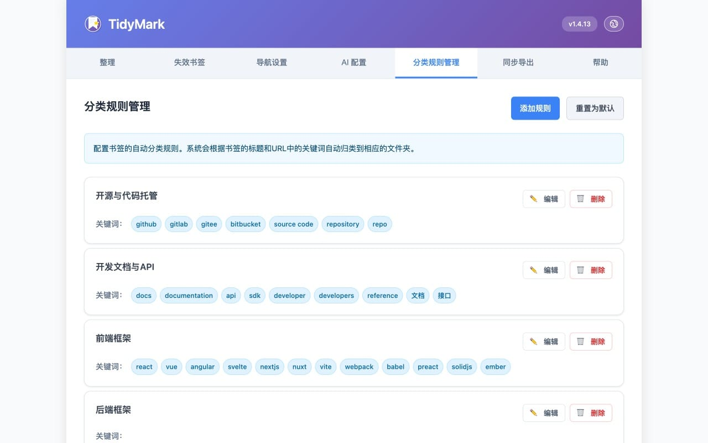
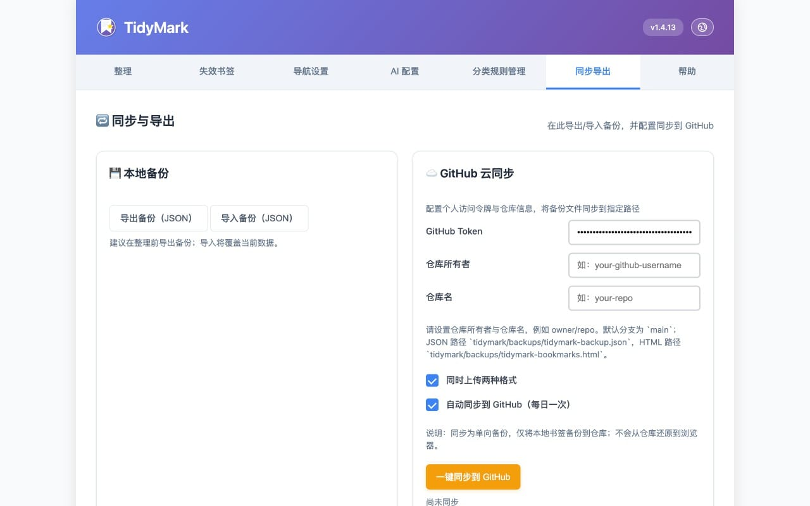
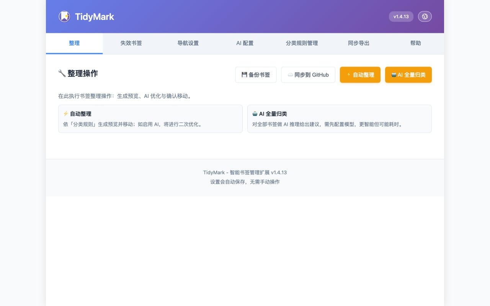
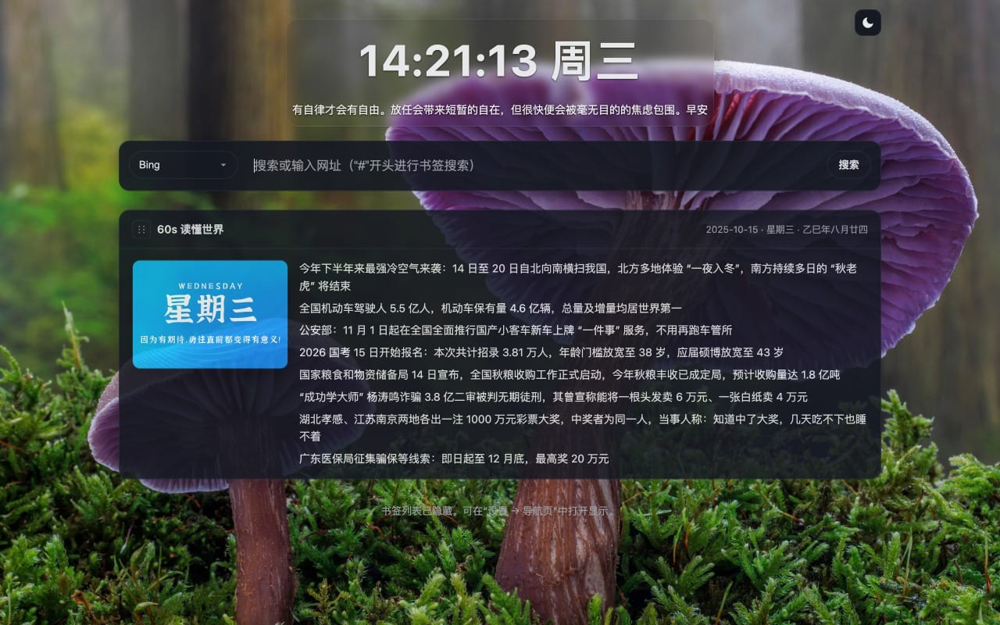

<!-- 语言切换：在此在英文与中文之间切换 -->
[English](./README.md) | [中文]

# TidyMark — 智能书签整理扩展

一个轻量的 Chrome/Edge 扩展，支持自动分类、AI 辅助整理、失效书签检测，以及新标签页导航。基于 Manifest V3 原生实现。

## 功能简介

- 自动分类：按规则一键整理书签到对应类别。
- AI 辅助：支持 OpenAI/DeepSeek（兼容接口），提升分类效果。
- 失效书签：扫描不可访问链接，支持批量删除或移动；可限定扫描指定文件夹，并可忽略内网/本地地址（127.0.0.1、localhost、10.x、192.168.x、172.16–31.x）。
- 新标签页导航：在新标签页展示分类导航与常用信息。
- 书签云同步 / 导出：支持每日自动进行 GitHub 书签备份（可在设置页配置），也可手动创建本地备份导出。
- 自动归档旧书签：按“最近访问时间”判断，将不常访问的书签移入“归档”文件夹（可设置阈值，默认 180 天；无访问记录时回退按添加时间）。
- 访问频率统计 / 使用热度分析：记录新标签页的书签访问次数与最近访问时间，支持热门栏目展示与基础使用分析。
- 右键菜单集成：在网页右键菜单中一键“添加到 TidyMark 并分类”，自动创建并移动到匹配分类文件夹。

## 安装方法

- 下载 GitHub Releases 的压缩包（ZIP）。
- 打开 `chrome://extensions/` 或 `edge://extensions/`。
- 开启“开发者模式”，点击“加载已解压的扩展程序”，选择解压后的文件夹。

## 界面截图

— 仅保留核心信息，更多细节请参考源码与注释。

## 许可证 / License

MIT License — 详见 `LICENSE`。