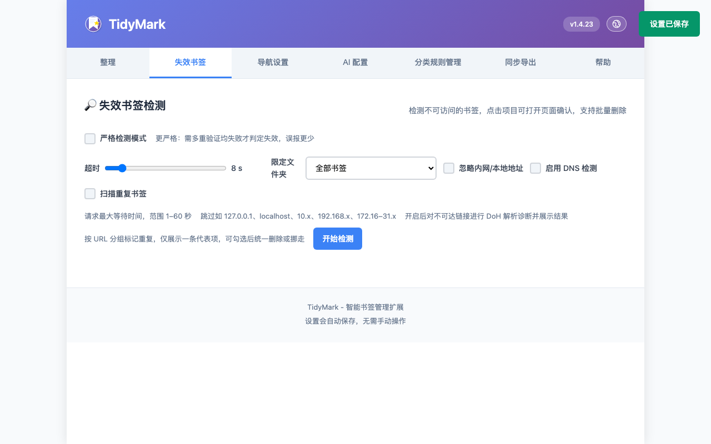

<!-- 语言切换：在此在英文与中文之间切换 -->
[English](./README.md) | [中文]

# TidyMark — 智能书签整理扩展

一个轻量的 Chrome/Edge 扩展，支持自动分类、AI 辅助整理、失效书签检测，以及新标签页导航。基于 Manifest V3 原生实现。

## 功能简介

- 自动分类：按规则一键整理书签到对应类别。
- AI 辅助：支持 OpenAI/DeepSeek（兼容接口），提升分类效果。
- 失效书签：扫描不可访问链接，支持批量删除或移动；可限定扫描指定文件夹，并可忽略内网/本地地址（127.0.0.1、localhost、10.x、192.168.x、172.16–31.x）。
- 新标签页导航：在新标签页展示分类导航与常用信息。
- 书签云同步 / 导出：支持每日自动进行 GitHub 书签备份（可在设置页配置），也可手动创建本地备份导出。
- 自动归档旧书签：按“最近访问时间”判断，将不常访问的书签移入“归档”文件夹（可设置阈值，默认 180 天；无访问记录时回退按添加时间）。
- 访问频率统计 / 使用热度分析：记录新标签页的书签访问次数与最近访问时间，支持热门栏目展示与基础使用分析。
- 右键菜单集成：在网页右键菜单中一键“添加到 TidyMark 并分类”，自动创建并移动到匹配分类文件夹。

## 安装方法

> 注意：安装完成后首次打开新标签页，浏览器可能弹出“是否保持由扩展设置的新标签页”的提示（Chrome/Edge）。如果你不需要导航页功能，请选择“拒绝 / 恢复默认”。这不会影响书签整理、分类、备份等核心功能，浏览器新标签页将保持默认样式。

- 推荐（商店安装）：
  - Chrome 应用商店：https://chromewebstore.google.com/detail/tidymark/kfjmkmodmoabhcmgeojbnjbipgiknfkb?utm_source=item-share-cb
  - Edge 扩展商店：https://microsoftedge.microsoft.com/addons/detail/tidymark/ndfhjpodnchjkgpheaompahphpknmpjp

**说明：如果不需要「新标签页导航」功能，安装后可在「设置 → 导航设置」中保持未开启；不影响书签整理等核心功能。**

- 开发者模式（保留）：
  - 下载 GitHub Releases 的压缩包（ZIP）：https://github.com/PanHywel/TidyMark/releases
  - 打开 `chrome://extensions/` 或 `edge://extensions/`。
  - 开启“开发者模式”，点击“加载已解压的扩展程序”，选择解压后的文件夹。

## 界面截图

— 仅保留核心信息，更多细节请参考源码与注释。

## 许可证 / License

MIT License — 详见 `LICENSE`。